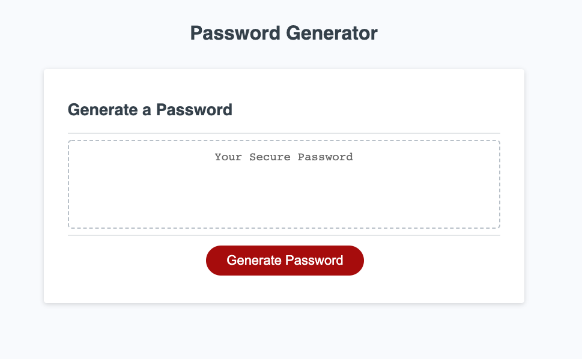
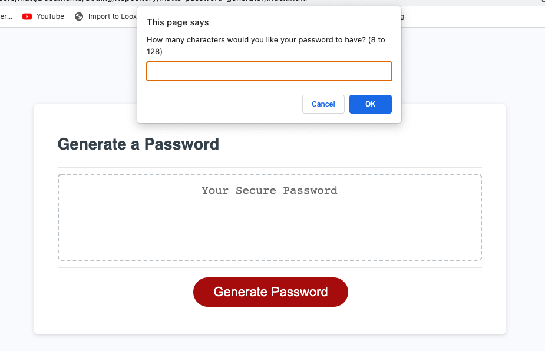

# Matt's Random Password Generator

## Description

This is a fun application to generate a random password if you are ever stuck in coming up with a creative password. The purpose of creating this application is to apply the things that we've learned in creating a dynamic website. This website will react according to what the user has chosen; it is not a plain boring website that will react the same way with no dynamic function. The password have 4 different categories that each user can opt in or out of. Through building this project, I've learned on utilizing the link between HTML and JS as much as possible to make a website dynamic. The most interesting part of this project is creating a logic for the app to function properly.

## Installation

- Download the HTML provided from gitlab.
- Create a github repository and clone it locally
- Start figuring out the relationship between the JS and HTML
- Put in the var that we would require and the function(s) that we would require
- Develop a logic using if else function in order to include or exclude the 4 unique inputs that we would ask the user.

## Usage

To use this application is very simple. The prompt will start once you click the button. Then windows prompt will pop out with questions to customize your password. Feel free to include or exclude the category that you would like. Once all of the questions have been answered, a password will be shown in the text box.

To generate a new password, simply click the button again and the prompt will be generated again.

If you change your mind in creating a password, simply click the cancel button.

 
This is the initial page that you will see:

Once you click the generate button, this prompt will show up:

## Credits

These are the list of websites that helped me out for this project:
- https://w3collective.com/random-password-generator-javascript/ 
- USYD bootcamp modules

## License

